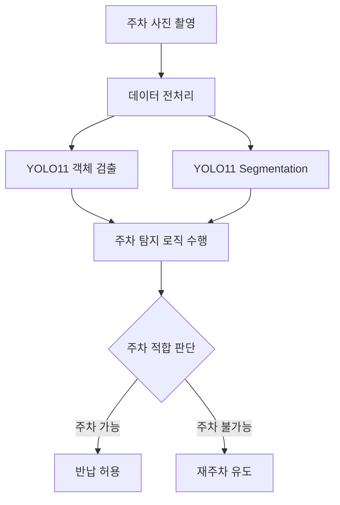

# AI Project I (2026 - 1)


## YOLO11 기반 온디바이스 AI 실시간 PM 주차 가이드 시스템
공유 전동킥보드(Personal Mobility, PM)의 부적절한 반납 문제를 줄이기 위해 설계한 온디바이스 AI 기반 실시간 주차 가이드 시스템입니다. 사용자가 반납 사진을 촬영하면 iOS 앱 내부에서 YOLO11 기반 객체 검출 모델과 세그멘테이션 모델이 동작하며, 전동킥보드와 주변 위험 시설물을 분석해 주차 가능 여부를 자동으로 판단 합니다.

본 프로젝트는 GPS 기반 반납 시스템만으로는 판별하기 어려운 실제 사진 속 위험 객체를 탐지하고, 사용자에게 반납 허용 또는 재주차 유도 결과를 제공하는 것을 목표로 합니다.


## 문제 정의
기존 공유 PM 서비스는 대부분 GPS 기반 반납 시스템을 사용합니다. GPS는 사용자가 특정 구역 안에 있는지를 확인하는 데에는 효과적이지만, 실제 사진 속 주차 위치가 안전한지 판단하는 데에는 한계가 있습니다.
기존 방식의 주요 한계는 다음과 같습니다.
| 한계 | 설명 |
| --- | --- |
| 위험 시설물 판단 불가 | 점자블록, 횡단보도, 소화전, 맨홀 등 세부 객체를 GPS만으로 판단하기 어렵다. |
| 보행자 안전 저해 | PM이 보행 동선이나 안전 시설물 주변에 방치될 경우 보행자 이동을 방해할 수 있다. |
| 부적절한 주차 반복 | 사용자가 실제 금지 구역에 반납해도 시스템이 이를 충분히 검증하지 못할 수 있다. |
| 정밀 판정 어려움 | GPS 오차와 실내외 환경 차이로 인해 세부 위치 기반 판단이 어렵다. |

따라서 본 프로젝트는 단순 위치 정보가 아니라, 사용자가 직접 촬영한 반납 사진을 기반으로 주차 적합성을 판단하는 방식에 주목하였습니다.


## 프로젝트의 플로우 차트
<p align="center">
  
</p>


## 데이터 세트
모델 학습에는 AI Hub에서 제공하는 안전 위험 시설물 및 도로 시설물 관련 데이터를 사용하였습니다. 객체 검출 모델에는 BBox 라벨링 데이터를 활용하였고, 횡단보도 탐지를 위한 세그멘테이션 모델에는 Polygon 라벨링 데이터를 활용하였습니다.

### 데이터 구성

<h3>데이터셋 구성</h3>

<table>
  <tr>
    <th>클래스</th>
    <th>예시 이미지</th>
    <th>라벨 형식</th>
    <th>이미지 수</th>
    <th>사용 목적</th>
    <th>총 크기</th>
  </tr>

  <tr>
    <td>전동킥보드</td>
    <td></td>
    <td>BBox</td>
    <td>7,000장</td>
    <td>PM 위치 및 크기 기준 객체</td>
    <td rowspan="5">
      25.36 GB<br><br>
    </td>
  </tr>

  <tr>
    <td>맨홀</td>
    <td></td>
    <td>BBox</td>
    <td>1,000장</td>
    <td>위험 객체 거리 판정</td>
  </tr>

  <tr>
    <td>소화전</td>
    <td></td>
    <td>BBox</td>
    <td>1,000장</td>
    <td>위험 객체 거리 판정</td>
  </tr>

  <tr>
    <td>점자블록</td>
    <td></td>
    <td>BBox</td>
    <td>1,000장</td>
    <td>보행 약자 안전 시설물 판정</td>
  </tr>

  <tr>
    <td>횡단보도</td>
    <td></td>
    <td>Polygon</td>
    <td>1,000장</td>
    <td>주차 금지 영역 판정</td>
  </tr>
</table>

### 데이터 출처

- AI Hub 이륜자동차 안전 위험 시설물 데이터
- AI Hub 보행 안전을 위한 도로 시설물 데이터

### 데이터 규모

| 항목 | 규모 |
| --- | --- |
| 이미지 수 | 약 7,000장 |
| 데이터 용량 | 약 25.36GB |

## 시스템 워크플로우

SAFEKICK의 전체 처리 흐름은 사용자의 반납 사진 촬영에서 시작해 객체 검출, 세그멘테이션, 주차 판정, 사용자 안내로 이어진다.



객체 검출 모델은 전동킥보드와 주변 위험 객체를 탐지하고, 세그멘테이션 모델은 횡단보도 영역을 분리한다. 이후 앱 내부의 주차 판정 로직이 두 모델의 결과를 함께 사용하여 최종 반납 가능 여부를 결정한다.

## 모델 구성

본 프로젝트에서는 두 개의 YOLO11 모델을 사용한다. 두 모델을 하나로 병합하지 않고, 앱 내부에서 객체 검출 모델과 세그멘테이션 모델이 각각 독립적으로 동작하도록 구성하였다.

### 객체 검출 모델

| 항목 | 내용 |
| --- | --- |
| 모델 | YOLO11s |
| 학습 Epoch | 70 Epoch |
| 라벨 형식 | BBox |
| 탐지 대상 | 전동킥보드, 맨홀, 소화전, 점자블록 |
| 사용 목적 | 킥보드와 위험 객체의 위치 관계 계산 |

### 세그멘테이션 모델

| 항목 | 내용 |
| --- | --- |
| 모델 | YOLO11n-seg |
| 학습 Epoch | 50 Epoch |
| 라벨 형식 | Polygon |
| 탐지 대상 | 횡단보도 |
| 사용 목적 | 킥보드가 횡단보도 영역 내부에 있는지 판단 |

두 모델의 역할을 분리한 이유는 객체별 라벨 형식과 판단 방식이 다르기 때문이다. 맨홀, 점자블록, 소화전은 BBox 중심점 기반 거리 계산에 적합하고, 횡단보도는 하나의 영역으로 판단해야 하므로 Polygon 기반 세그멘테이션이 더 적합하다.

## 주차 판정 로직

주차 판정은 킥보드와 위험 객체 사이의 정규화 거리(Normalized Distance)를 기준으로 수행한다. 사진은 촬영 위치, 각도, 거리, 렌즈 시야각에 따라 실제 거리와 픽셀 거리가 다르게 나타난다. 따라서 실제 물리 거리를 직접 계산하기보다, 사진 속 킥보드 높이를 기준으로 상대 거리를 정규화하여 판단한다.

### 변수 정의

| 변수 | 설명 |
| --- | --- |
| `Kh` | 킥보드 BBox의 높이(px) |
| `Km` | 킥보드 BBox의 중심점 |
| `Om` | 위험 객체 BBox의 중심점 |
| `dis` | `Km`과 `Om` 사이의 거리(px) |
| `T` | 객체별 거리 임계값 |

정규화 거리는 다음과 같이 계산한다.

```text
Normalized Distance = dis / Kh
```

### 판정 기준

| 조건 | 결과 |
| --- | --- |
| `Normalized Distance <= T` | 주차 금지 |
| `Normalized Distance > T` | 주차 허용 |

### 객체별 임계값

| 객체 | 임계값 `T` | 판정 의미 |
| --- | ---: | --- |
| 맨홀 | 0.7 | 킥보드가 맨홀에 매우 근접하거나 겹치는 경우 주차 금지 |
| 점자블록 | 0.8 | 보행 약자 이동을 방해할 가능성이 있는 경우 주차 금지 |
| 소화전 | 1.1 | 긴급 시설물 접근을 방해할 가능성이 있는 경우 주차 금지 |

횡단보도는 거리 계산을 적용하지 않는다. 횡단보도는 보행자가 직접 이동하는 영역이므로, 킥보드가 Segmentation Polygon 내부에 존재하면 거리와 관계없이 주차 금지로 판단한다.

## 서비스 앱 구현

SAFEKICK 서비스 앱은 사용자가 실제 PM 반납 상황에서 사용할 수 있도록 iOS 기반으로 구현하였다. 사용자는 앱에서 반납 사진을 촬영하고, AI 분석 결과에 따라 정상 반납 또는 위험 반납 안내를 받는다.

### 주요 화면

| 화면 | 설명 |
| --- | --- |
| 메인 화면 | 서비스 시작 및 주차 사진 촬영 진입 |
| 사이드 메뉴 화면 | 앱 내 부가 기능 및 메뉴 접근 |
| 위험 반납 판정 화면 | 주차 금지 객체가 탐지되었을 때 재주차를 유도 |
| 정상 반납 판정 화면 | 주차 가능으로 판단된 경우 반납 허용 결과 제공 |

### 주요 기능

- 주차 사진 촬영
- 온디바이스 AI 추론
- 객체 검출 결과 시각화
- 횡단보도 영역 분석
- 주차 가능 / 불가능 결과 제공
- 사용자 재주차 유도

## 연구용 앱 구현

서비스 앱과 별도로, 온디바이스 성능과 Confidence Threshold를 확인하기 위한 연구용 앱을 추가 구현하였다. 연구용 앱은 모델의 실제 동작 결과를 확인하고, 필드 테스트 과정에서 객체별 탐지 안정성을 분석하기 위해 사용하였다.

### 연구용 앱 기능

| 기능 | 설명 |
| --- | --- |
| 객체 검출 화면 | 사진 속 탐지 객체와 BBox 결과를 확인 |
| 디버깅 화면 | 모델 출력과 판정 과정을 분석 |
| 검출 객체 확인 | 객체별 탐지 여부와 Confidence 확인 |
| Confidence Threshold 모니터링 | Threshold 변화에 따른 탐지 결과 비교 |
| 전체 추론시간 측정 | 온디바이스 추론 성능 측정 |
| 메모리 사용량 측정 | 기기별 메모리 사용량 확인 |

## 필드 테스트

필드 테스트는 총 3차례 진행하였다. 주간과 야간 환경을 모두 포함하여 객체 탐지 성능과 주차 판정 로직의 현장 적용 가능성을 확인하였다.

### 테스트 환경

| 차수 | 일자 | 장소 | 조건 |
| --- | --- | --- | --- |
| 1차 | 2026/06/03 | 캠퍼스 주변 | 주중 |
| 2차 | 2026/06/06 | 관저동 일대 | 주간 |
| 3차 | 2026/06/06 | 관저동 일대 | 야간 |

### 테스트 방법

| 항목 | 내용 |
| --- | --- |
| 촬영 횟수 | 객체별 20회 촬영 |
| 촬영 거리 | 킥보드와 객체 간 5m 내외 |
| 촬영 각도 | 킥보드 측면과 객체가 잘 보이는 구도 |
| 테스트 조건 | 주간 및 야간 상황 모두 포함 |

### 테스트 결과

- 킥보드는 20회 모두 인식되었다.
- 맨홀 객체와 횡단보도 영역은 비교적 우수한 인식 성능을 보였다.
- 점자블록과 소화전은 인식률이 낮거나 상황에 따라 불안정하게 탐지되었다.
- 야간 상황에서는 전체적으로 객체 탐지 성능이 저하되었다.
- Confidence Threshold 조정을 통해 일부 객체의 인식 결과가 개선되었다.

## 온디바이스 성능 결과

서비스 적용 가능성을 확인하기 위해 iPhone 기기에서 전체 추론시간과 메모리 사용량을 측정하였다.

### 전체 추론시간

| Device | Avg Inference Time |
| --- | ---: |
| iPhone 14 Pro | 255 ms |
| iPhone 17 Pro | 200 ms |

### 메모리 사용량

| Device | Avg Memory Usage |
| --- | ---: |
| iPhone 14 Pro | 391 MB |
| iPhone 17 Pro | 365 MB |

측정 결과 두 기기 모두 실시간 반납 판단에 활용 가능한 수준의 추론시간을 보였다. iPhone 17 Pro는 iPhone 14 Pro 대비 평균 추론시간과 메모리 사용량이 모두 낮게 측정되어, 최신 기기에서 더 안정적인 온디바이스 처리 성능을 기대할 수 있었다.

## 한계 및 향후 연구

### 한계

- 다양한 객체 종류에 대한 데이터셋이 아직 충분하지 않다.
- 실제 서비스 환경을 모두 반영할 만큼 촬영 환경이 다양하지 않다.
- 촬영 각도, 거리, 날씨, 시간대 변화에 따른 데이터가 부족하다.
- 야간 및 저조도 환경에서 객체 인식 성능이 저하된다.
- 점자블록과 소화전은 현장 조건에 따라 탐지 안정성이 낮게 나타났다.

### 향후 연구

- 다양한 도심 환경을 반영한 데이터셋 추가 구축
- 야간, 우천, 역광 등 환경 변화에 대응하기 위한 데이터 증강 적용
- 객체별 거리 임계값 `T` 자동 최적화
- 실제 공유 PM 서비스와 연계한 실증 테스트
- 사용자 평가를 통한 안내 문구 및 반납 UX 개선
- 객체별 탐지 성능 개선을 위한 추가 학습 및 라벨 품질 보완

## 팀 구성

| 이름 | 학번 | 역할 |
| --- | --- | --- |
| 송지성 | 22619013 | iOS 앱 구현 및 서비스 화면 구성 |
| 허동회 | 22619022 | YOLO11 모델 학습, 주차 판정 로직 설계, 온디바이스 추론 테스트 |
| 비비안 | 24619043 | 데이터셋 정리, 필드 테스트, 결과 분석 보조 |

각 팀원은 모델 학습, 앱 구현, 데이터 정리, 현장 테스트를 나누어 수행하였다. 특히 서비스 앱과 연구용 앱을 함께 구현하여 실제 사용자 관점의 기능과 연구 분석 관점의 성능 확인을 동시에 진행하였다.

## 결론

SAFEKICK는 공유 PM 반납 과정에서 발생하는 부적절한 주차 문제를 사진 기반 AI 분석으로 해결하고자 한 프로젝트이다. GPS 기반 방식의 한계를 보완하기 위해 YOLO11 객체 검출 모델과 YOLO11 세그멘테이션 모델을 iOS 앱 내부에서 실행하였으며, 전동킥보드와 위험 시설물의 위치 관계를 바탕으로 주차 가능 여부를 자동 판단하였다.

본 프로젝트의 의의는 단순한 객체 탐지를 넘어, 실제 PM 반납 상황에서 사용 가능한 주차 판정 로직과 온디바이스 앱 구현을 함께 제시했다는 점에 있다. 필드 테스트 결과 일부 객체와 야간 환경에서는 성능 개선이 필요했지만, 킥보드, 맨홀, 횡단보도 등 주요 대상에 대해서는 서비스 적용 가능성을 확인할 수 있었다.

향후 데이터셋 확장, 임계값 최적화, 실제 서비스 연계를 통해 SAFEKICK는 보행자 안전을 높이고 공유 PM 반납 문화를 개선하는 실용적인 AI 주차 가이드 시스템으로 발전할 수 있다.
